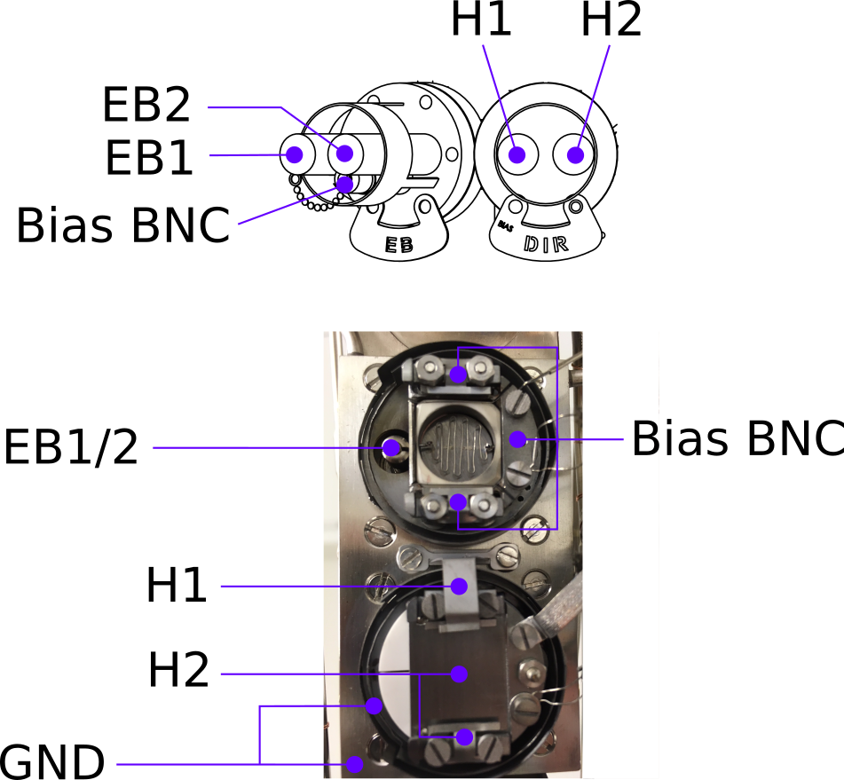
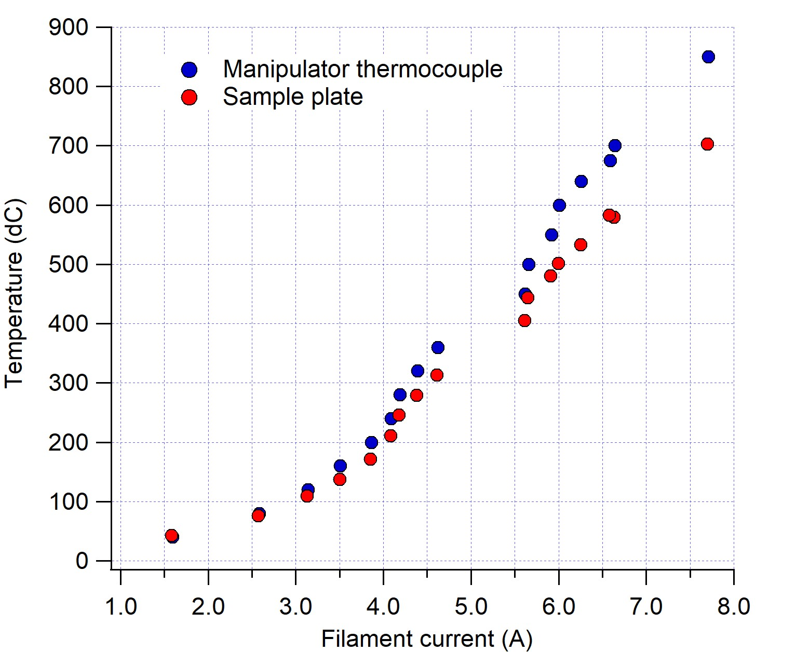
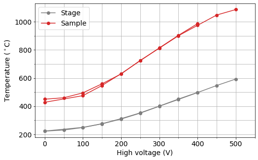

<!--more-->
# 

- [Specifications](#Specifications)
- [Sample receivers](#Receivers)
- [Moving the manipulator](#Moving)
- [Sputtering](#Sputtering)
- [Heating](#Heating)
- [LN2 cooling](#Cooling)

[Port layout (pdf)](images/PortLayout.pdf)

[Manipulator drawing (pdf)](images/manipulator.pdf)

---
# Specifications

|Parameter | Value|
|----------|------|
|Manipulator axes | XYZ+Polar|
|Heating| Direct current (>1200&deg;C), resistive (700&deg;C), e-beam (1400&deg;C)|
|Lowest sample temperature (LN2)| 112K |
|LEED?| Yes|
|Crystal growth monitor?| Yes (on manipulator)|
|Sputtering?| Yes|
|Gas dosing?| Yes|
|Cleaving?| Ask|

[[Top]](#top)

---

# Sample receivers

The PrepSec manipulator has two sample receivers. The upper can perform electron-beam (EB) heating, the lower can perform both direct-current (DC) heating (i.e. pass a current through the sample) and resistive filament heating (RH) (i.e. heat a filament hidden beneath the sample receiver). 

[[Top]](#top)

---

# Moving the manipulator

** Work in progress **

[[Top]](#top)

---
# Sputtering

(See also the dedicated 'Sputtering' page)

Sputter current can be measured in both sample slots, with some important caveats:

In the lower (DH/RH) slot, connect a suitable ammeter (e.g. Keithley 6485) between the H2 terminal and the grounded chamber chassis. Manually ground the H1 terminal.

In the upper slot (EB), connect the meter between the bias BNC and the grounded chamber chassis. This measurement is only possible when there is no emission current from the ebeam filament.

In both cases, what is being measured is the total sputter current impinging on the entire sample plate. **It is not necessarily hitting your sample**. 

We have a dedicated test sample for locating the size and position of the sputter beam at normal incidence, so the saved manipulator positions should correctly position your sample in front of the beam.

Remember to ground the BIAS or H2 terminals when you remove the ammeter, otherwise the sample can charge while sputtering.

[[Top]](#top)

---

# Heating

There is a compressed air line close to the PrepSec chamber, which can be used to air-cool the manipulator rather than deal with cryogens. This is quite useful for improving the chamber pressure while operating the sample heaters. It is a good idea to run air cooling any time you are heating. 

## Direct current

The wiring is rated for 10A continuous current. Slightly higher values are OK for durations of a few minutes. Ask first if you need to go much higher.

## Resistive

There is a tungsten filament hidden underneath the sample receiver. The connections to this filament are also located at the top of the manipulator and labelled 'H1' and 'H2', but have their own feedthrough labelled 'RES'.

To prolong the life of the filament, we ask that you ramp the filament over a period of at least a minute, and **stay below a current of 8A**. If you need high temperatures, it is better for the equipment and for the chamber pressure if you use e-beam heating instead.

 It is possible to use the Prevac HEAT3 controller in the rack to run this heater, but you may find it more convenient to bring a simple DC power supply close to the chamber.

There is a thermocouple mounted to the sample stage, but due to the loose clamping of sample plates in the stage, the thermocouple generally reads much higher than your sample actually is. 

The calibration chart below was made using a flat-plate sample with a thermocouple spot-welded to the surface (May 2018). Compressed air was running to cool the manipulator. The heater has since been exchanged, so consider this only a starting point, and remember that your sample temperature can be significantly lower if it does not have very good thermal contact to the sample plate.

## E-beam

The upper receiver is for electron-beam heating. Here the sample is grounded, and the filament and the shield surrounding it are raised to high voltage. Temperatures of up to 1400&deg;C are achievable. To provide the high voltage, it is necessary to use the Prevac HEAT3 controller in the rack. 

**The bias BNC must have a grounding plug installed when ebeam heating**, otherwise the sample stage is electrically floating and the emitted electrons find some other grounded component to go to.

Like the resistive heating stage, a thermocouple is mounted on the sample receiver. In this case it should also not be trusted - here it will always *under-read* the sample temperature, sometimes by several hundred degrees. You must use a pyrometer to monitor your sample temperature, and never use the automatic PID control option in the HEAT3 controller.

With no high-voltage applied, the heater can be operated as a simple resistive heater. However, since this filament is very thin and fragile, you must treat it very gently - slow ramps and never more than 3.3A.

With e-beam heating, aim to fix the filament current at the lowest value you can that still reaches the desired temperature. Temperature control is then by setting the high voltage, 0-1kV.

The calibration chart below was made using a flat-plate sample with a thermocouple spot-welded to the surface (Dec 2019). Compressed air was running to cool the manipulator. Remember that your sample temperature can be significantly lower if it does not have very good thermal contact to the sample plate.

<!--
# Quartz crystal thickness monitor
On the reverse side of the bottom of the manipulator there is a water-cooled quartz crystal microbalance (without shutter). It is 43.5mm below the center of the resistive heating stage, and 79.5mm below the center of the ebeam heating stage. It is not necessary to purge the water lines when cooling the manipulator.-->

[[Top]](#top)

---

# LN2 cooling

With a pressurized dewar it is possible to send LN2 directly into the cooling line of the manipulator. In practice this is difficult, since the tube diameter is quite small, the inlet is quite high up, and the plumbing is not yet set up in an elegant way. 

An alternative, easier approach is to use a heat-exchanger coil. Here N2 gas is sent through the manipulator, but before entering it passes through a copper coil immersed in a small polystyrene dewar of LN2. The heat transfer is very effective and can partially liquify the N2.

Base temperature with this technique is 89K on the receiver thermocouple, 112K on the sample plate (due to a lack of clamping) with a cooldown time of 20 minutes. **Only the lower receiver is cooled**

[[Top]](#top)

---